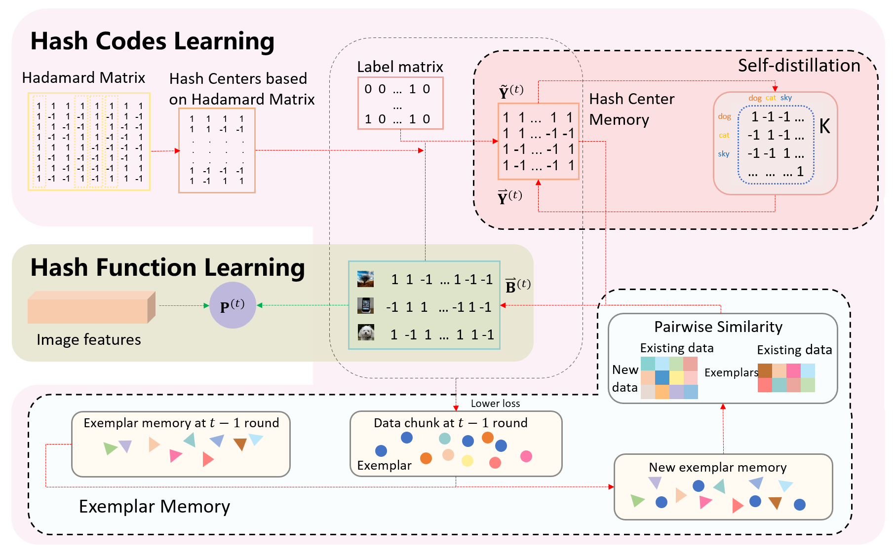

# [ACM MM 2023] Self-Distillation Dual-Memory Online Hashing with Hash Centers for Streaming Data Retrieval

Official matlab implementation of **SDOH-HC**, from the following paper:
> [**Self-Distillation Dual-Memory Online Hashing with Hash Centers for Streaming Data Retrieval**](https://github.com/ZCyueternal/SDOH-HC) <br>
> [Chong-Yu Zhang](https://scholar.google.com.hk/citations?hl=en&user=OsbUzCMAAAAJ), [Xin Luo](https://scholar.google.com.hk/citations?hl=en&user=ZaCsoy0AAAAJ), [Yu-Wei Zhan](https://scholar.google.com.hk/citations?user=iM_-4-sAAAAJ&hl=en&oi=sra), [Peng-Fei Zhang](https://scholar.google.com.hk/citations?hl=en&user=KTnEPf8AAAAJ), [Zhen-Duo Chen](https://scholar.google.com.hk/citations?user=v28-0D0AAAAJ&hl=en&oi=sra), [Yongxin Wang](https://scholar.google.com.hk/citations?user=0SnREAQAAAAJ&hl=en&oi=sra), [Xun Yang](https://scholar.google.com.hk/citations?user=ro8lzsUAAAAJ&hl=en&oi=ao), and [Xin-Shun Xu](https://scholar.google.com.hk/citations?user=ICzwFaIAAAAJ&hl=en&oi=ao). 

## Highlights

## Running Environment
```matlab
Matlab
```

## Datasets
We use three datasets to perform our experiments, i.e., CIFAR-10, MIRFLICKR-25K, and NUS-WIDE. 
<br>
You can download all dataset from [HERE](https://pan.baidu.com/s/1BXnhm00jKEveCcZCN4ixsg?pwd=0408). 


## Run demo

Run mymain.m.

```matlab
mymain
```

## Some important files:
[mymain.m](./mymain.m): main program.  
[train_twostep.m](train_twostep.m): function to compute the hash code and hash function of training data.    
[mAP.m](mAP.m) : function to compute the mAP of hashing method.  
[Kernelize.m](Kernelize.m): function to transform the original features to kernel features.  


## Citation
If you find our work is useful for your research, please consider citing:

```bibtex
@inProceedings{zhang2023self,
author = {Zhang, Chong-Yu and Luo, Xin and Zhan, Yu-Wei and Zhang, Peng-Fei and Chen, Zhen-Duo and Wang Yongxin and Yang, Xun and Xu, Xin-Shun},
title = {Self-distillation dual-memory online hashing with hash centers for streaming data retrieval},
booktitle = {Proceedings of the 31st ACM International Conference on Multimedia},
pages={6340--6349},
year = {2023}
}
```

## Contact
If you have any questions, feel free to contact [us](mailto:zhangchongyu22@gmail.com?subject=[Github%20Problems%20SDOH-HC]).


## Stars
**Stargazers**

[](https://github.com/ZCyueternal/SDOH-HC/stargazers)
